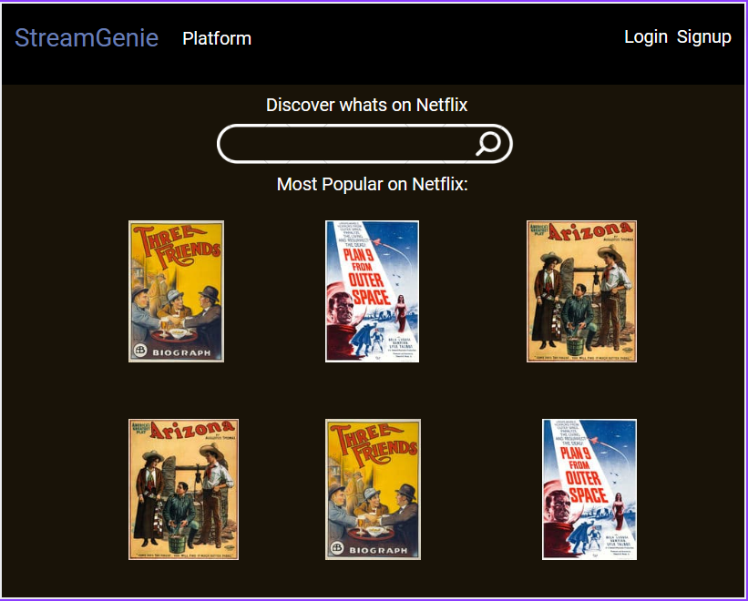
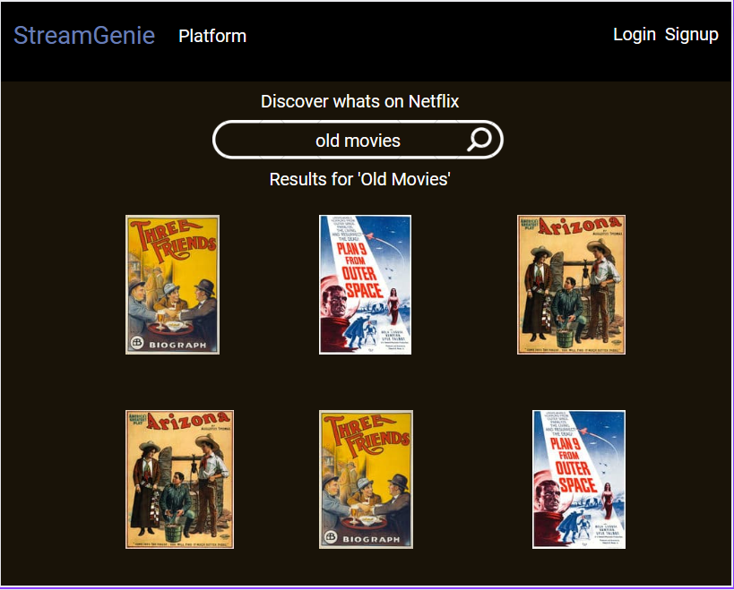
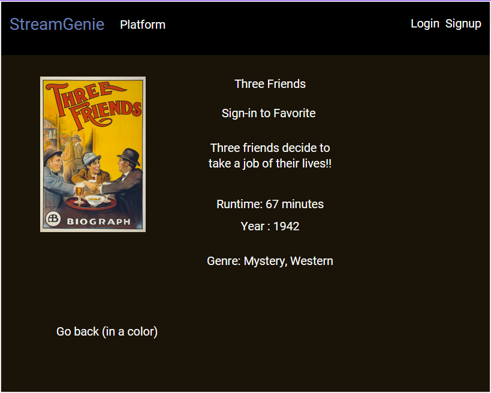
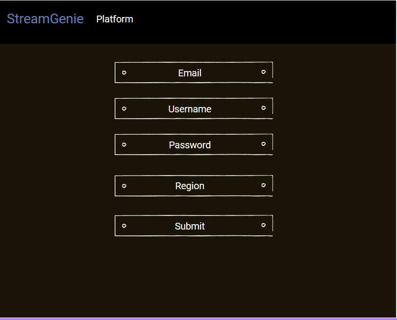
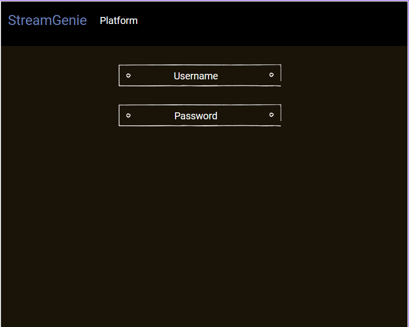
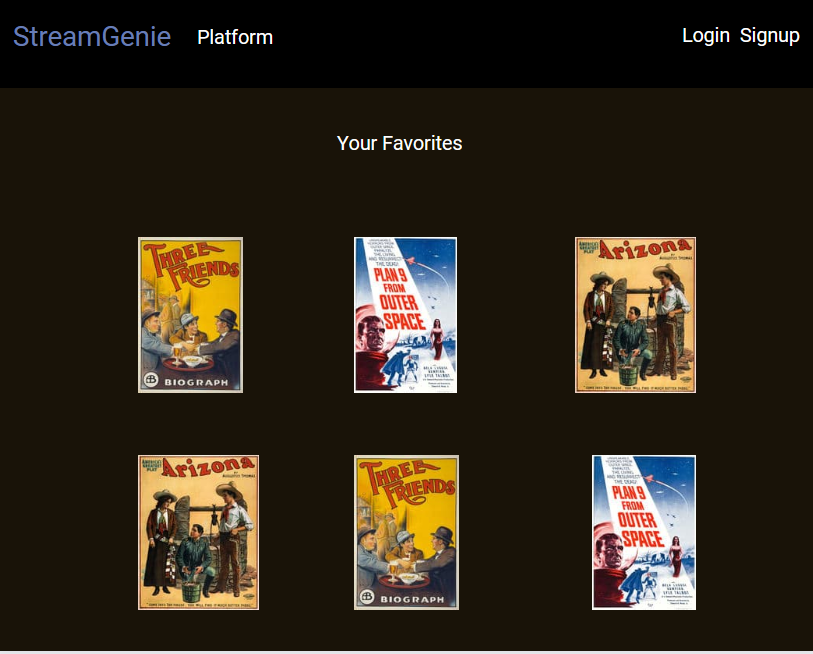

Streamgenie is a movie and TV website where you can search for media titles including favorite TV and movies and do various searches. The website allows for favorites and platform recommendations to find each title.

API Repository: https://github.com/Rando-cal/streamgenie-react-back

Deploy Link: https://streamgenie-back.herokuapp.com/ (issues)

## FRONT-END

## User Stories
- You can Sign-up
- You can Login
- You can Search without login, but Favoriting is hidden
- Once Sign-up/in you can favorite a Title
- You can search for TV and movie titles
- You can choose from the results and click each to be brought to info. page
    -This page will show Title, Image, Description, Release Year, Genre, Runtime, and Rating
- Search on 'index' page that shows Title, Year, Genre, Image, Tagline
- You can goto Profile Settings page to update your Region
- You can Sign-out
- View where Title is available for streaming *
- View where Title is available for Purchase *
- You can have a Profile where you set your Region *
- You can use various search filters for: Region, Year, Rating Over 90%, Keywords *
- Trending carousel *
- IBM Watson Voice-to-Text for searching Title *
- (* - Stretch Goals)
    

## Technologies

### MERN Stack
- React.js - Frontend
- Express - Backend web framework
- MongoDb - Database
- Node.js - JavaScript web server

### NPM Modules

Frontend
- axios - making API and backend requests
- bootstrap - CSS styling
- dotenv - setting and hiding our backend variables
- react - front-end JavaScript library
- react-bootstrap - UI styling for REACT
- react-dom - allows for DOM-specific methods
- react-router-dom - implmentation of web page routing
- react-scripts - code to create scripts and configurations
- sass - CSS extension scripting
- uuid - npm package to create universally unique identifiers

Backend
- axios
- bcrypt - a password security platform
- cors - supports secure cross-origin requests and data transfers between browsers and servers.
- dotenv - setting and hiding our backend variables
- Express - Node web framework
- jsonwebtoken - for trasmitting information between parties as a JSON object.
- method-override - allows for PATCH, DELETE HTTP requests
- MongoDb - open-source NoSQL database management program
- mongoose - Mongoose is an Object Data Modeling (ODM) library for MongoDB and Node.js
- passport - authentication middleware for Node. js
- passport-http-bearer - HTTP Bearer authentication strategy for Passport

## Wireframes

## Color Pallette
#191308 (Black Chocolate), #322A26 (Black Coffee), #454B66 (Independence), #677DB7 (Glaucous), #9CA3DB (Maximum Blue Purple), #000000 (black), #FFFFFF (white)

## Font
Google Roboto

link rel="preconnect" href="https://fonts.googleapis.com"
link rel="preconnect" href="https://fonts.gstatic.com" crossorigin
link href="https://fonts.googleapis.com/css2?family=Bungee&family=Inter&family=M+PLUS+1p:wght@300&family=Poiret+One&family=Poppins:wght@500;600;700&family=Source+Sans+Pro&display=swap" rel="stylesheet">

font-family: 'Bungee', cursive;

font-family: 'Inter', sans-serif;

font-family: 'M PLUS 1p', sans-serif;

font-family: 'Poiret One', cursive;

font-family: 'Poppins', sans-serif;

font-family: 'Source Sans Pro', sans-serif;

## Roles
Randy D'Abbraccio - Frontend & Manager |
Christian Brewer - Backend API & Frontend
